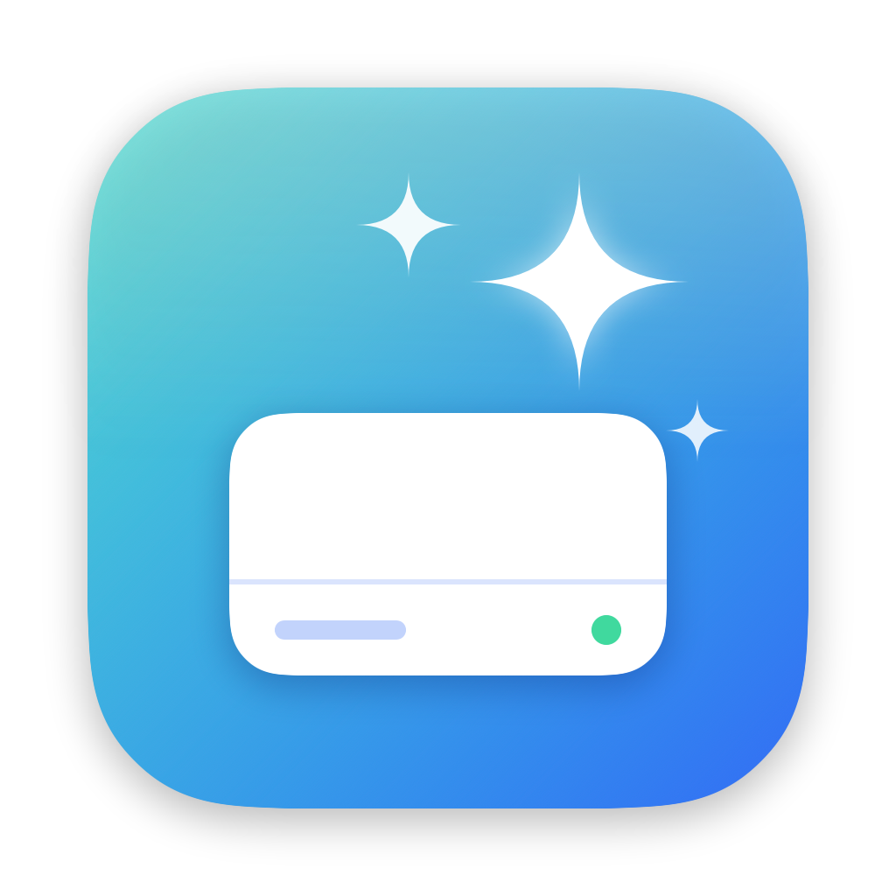
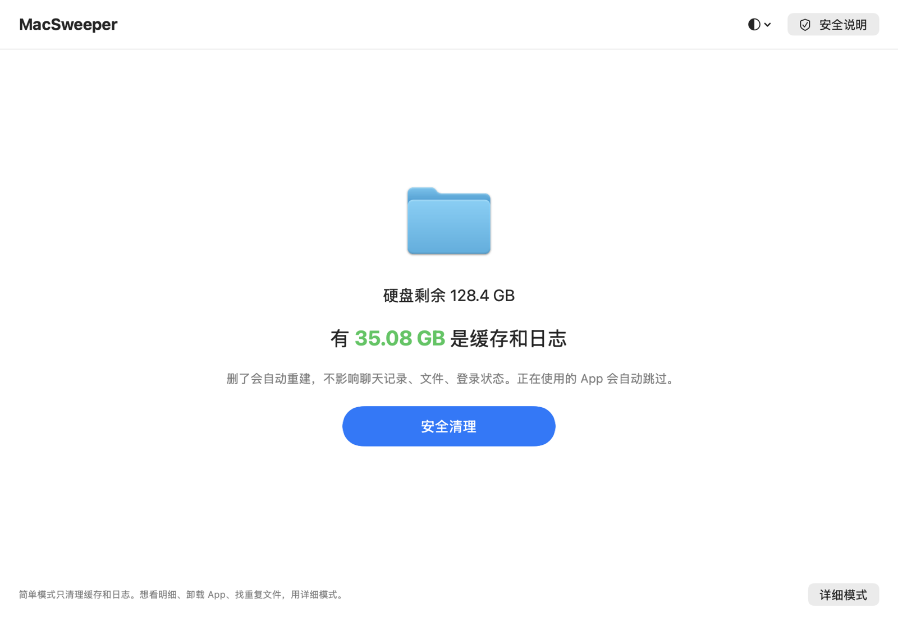

<p align="center">
  
</p>

<h1 align="center">MacSweeper</h1>

<p align="center">A safe, transparent, free disk cleaner for Mac · Native SwiftUI · Only moves files to the Trash, never deletes them directly</p>

<p align="center"><a href="README.md">中文</a> · English</p>

<p align="center"></p>

## In three sentences

1. It opens in **Simple mode**: one number (how much cache can be safely cleaned) and one button (Safe Clean). It only touches caches and logs that are rebuilt automatically, skips apps that are running, and never touches chats, files or sign-ins.
2. Everything only goes to the **Trash** and can be undone with one click. Emptying the Trash is always your own decision.
3. Switch to **Detailed mode** to see every item, uninstall apps, find duplicates or view the space map. Every item says what it is, what happens if removed and how we know.

## Detailed mode

- **Caches and logs**: app caches, sandboxed app caches, logs, developer caches (npm, Rust, Gradle, Xcode)
- **Big apps**: WeChat's built-in browser cache (often tens of GB), WeChat temp files, Chrome and Electron app web caches (bookmarks, passwords and sign-ins are never touched)
- **AI tools & projects**: grouped by tool with each tool's own icon — how much Codex, Claude, ChatCut, WorkBuddy, Qwen, DeepSeek and others use and what can be cleaned; dependencies (node_modules, .venv) of projects you haven't touched for a while; leftovers of uninstalled AI tools; broken command links
- **Leftovers of uninstalled apps**, detected conservatively: when in doubt, it's skipped
- **Large files** over 500 MB in your home folder, reviewed one by one
- **Per-item selection**: expand any category to see each folder's size and last-modified date
- **Running apps are protected**: their files are skipped, or use "Quit and Clean" to quit the app, clean, and reopen it
- **Uninstall apps**: see apps you haven't used in a long time; select one and press ⌘⌫ (or right-click, or drag it into the window or onto the Dock icon) to review everything that goes with it — caches, settings, login items — before moving it all to the Trash. Undoable
- **Uninstall from Finder** (right-click → Services → Uninstall with MacSweeper) and **cleanup offers when you drag an app to the Trash**: MacSweeper notices the app left Applications and offers to clean up what it left behind
- **Duplicates**: finds files with identical content (byte by byte), recognizes APFS clones that free no space, skips project folders and app data. Nothing is checked by default and at least one copy is always kept
- **Space map**: see what takes up your home folder as nested blocks; click to look inside. View only
- **Menu bar widget** showing free space (turns orange and notifies when low) and **update notices** from GitHub releases
- **Undo last cleanup**: put everything from the last cleanup back where it was
- **Custom rules** in a JSON file, no code changes needed
- Chinese and English, following your system language

## Install

Download the latest `MacSweeper-x.y.z.dmg` from [Releases](../../releases) and drag MacSweeper into Applications. Requires macOS 13 or later; Apple silicon and Intel are both supported.

> MacSweeper isn't signed with an Apple Developer ID yet, so macOS blocks it the first time:
> 1. Double-click MacSweeper and click "Done" when the warning appears
> 2. Open System Settings → Privacy & Security, scroll down and click **Open Anyway** next to MacSweeper
> 3. From then on it opens normally (on macOS 14 or earlier you can also right-click → Open)

## Safety

**Safety you can see**: every rule carries an “if removed” label (rebuilt automatically / re-download needed / not recoverable), every category expands into an explanation card (what it is, what happens, how we know), “review first” categories must be expanded before they can be checked as a whole, non-recoverable items can only be checked one by one and are flagged in the confirmation, the first scan pre-selects nothing, large files show their type, download origin and last-opened date with a preview, and “Export list” saves what you're about to remove as a text file to share or ask about.

- Files are **only moved to the Trash**, never deleted. You empty the Trash yourself
- You always see the list and confirm before anything is moved; the CLI has `--dry-run`
- Only files inside your home folder; protected folders (Desktop, Documents, Library…) themselves are never touched
- Whole-app data (WeChat, Chrome, Docker, iPhone backups) is report-only; only the parts that are clearly caches can be cleaned
- Apps that are running (GUI or command line) lock their own files, checked again at the moment of cleaning
- Every operation is logged in `~/Library/Logs/MacSweeper/operations.log`

## Build from source

Only the Xcode Command Line Tools are needed (`xcode-select --install`), not the full Xcode.

```bash
./scripts/build-app.sh     # build/MacSweeper.app
./scripts/make-dmg.sh      # build/MacSweeper-x.y.z.dmg (optional Developer ID signing and notarization)
./scripts/selftest.sh      # self-test of the safety logic, no Xcode needed
swift build -c release     # command-line tool: .build/release/sweep
```

## Custom rules

Click the rules button in the top-right corner (or edit `~/Library/Application Support/MacSweeper/自定义规则.json`). Each rule looks like:

```json
{
  "name": "Some app's cache",
  "safety": "review",
  "contents": "~/Library/Application Support/SomeApp/Cache",
  "quitApps": ["com.example.app"]
}
```

`safety` is `safe`, `review` (default) or `reportOnly`. Use exactly one target: `contents`, `paths` (wildcards allowed) or `files` (`{"in": "~/Downloads", "extensions": ["zip"]}`). Paths must start with `~/`. Custom rules are bound by all the same safety rules.

## Translations

Translations live in `scripts/translations.py`. After changing UI text or rules, run `python3 scripts/translations.py`: it checks that every string has a translation with matching placeholders and generates `Resources/en.lproj/Localizable.strings`. The self-test checks every built-in rule.

## License

[MIT](LICENSE)
