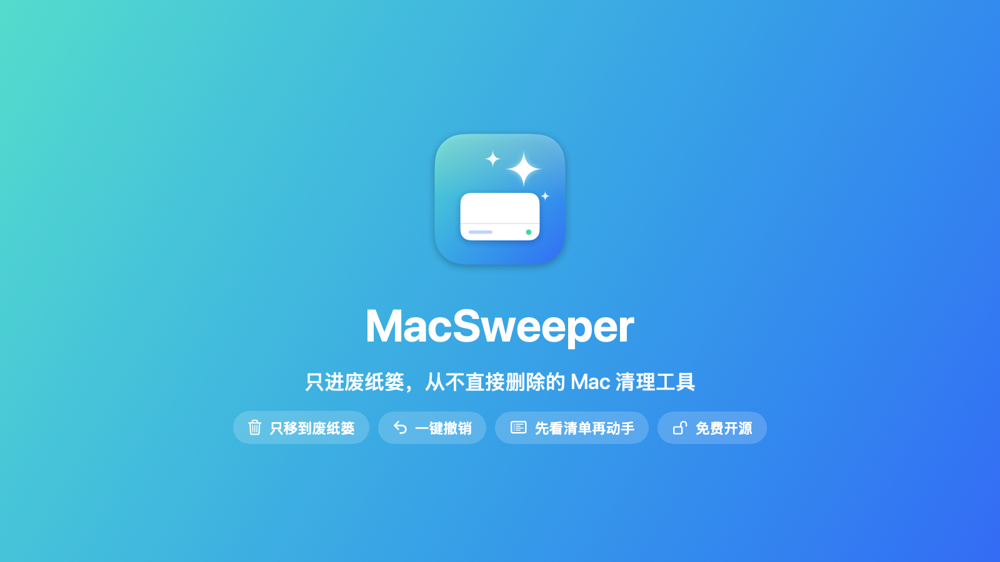
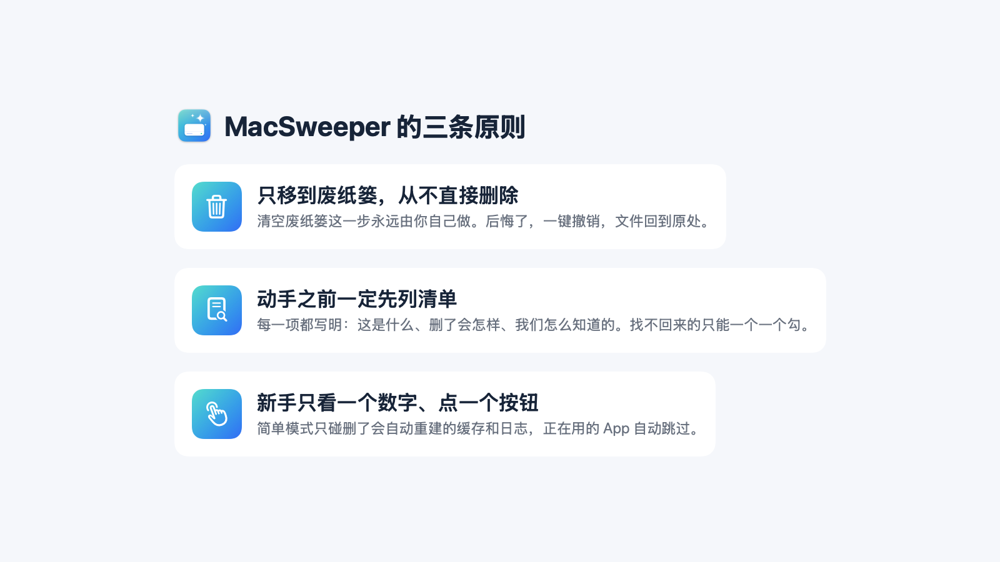
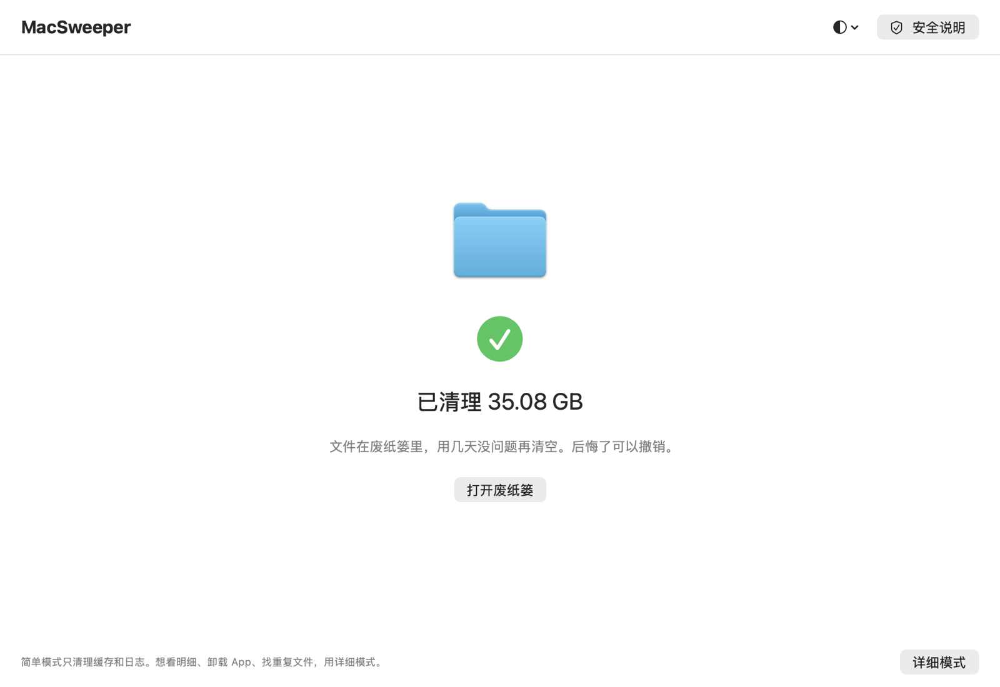
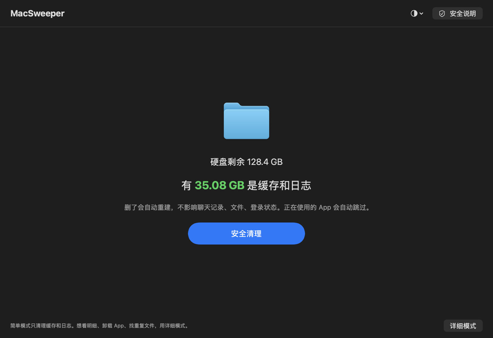
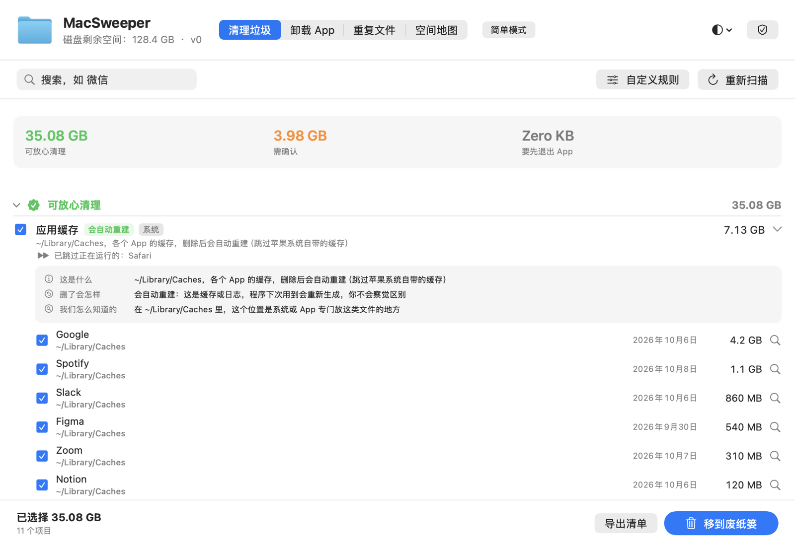
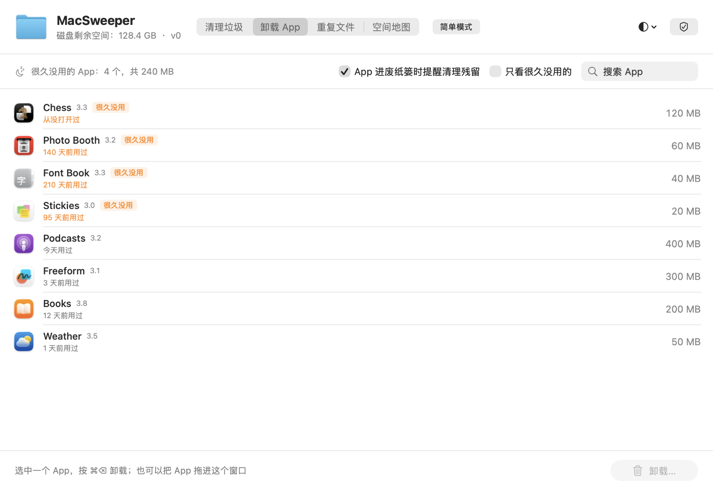
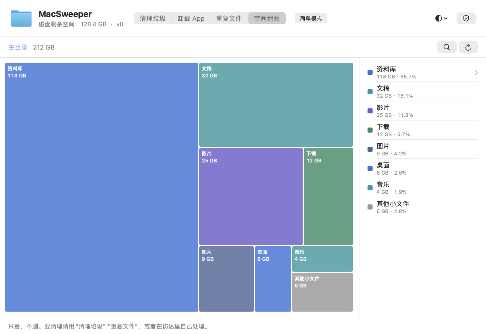
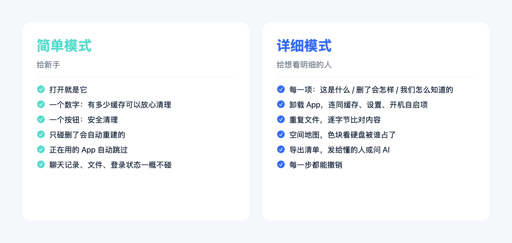

# MacSweeper 宣传文案

下载：https://github.com/bianzigege/MacSweeper/releases

---

## 一句话版（标题、签名、转发语）

- 免费开源的 Mac 清理工具，只进废纸篓、从不直接删，后悔了一键撤销。
- 我做了个 Mac 清理工具：一个数字，一个按钮，删错了能撤销。
- 不敢用清理软件？这个只会把东西移到废纸篓。

---

## 朋友圈 / 即刻版（短）

做了个 Mac 清理工具，叫 MacSweeper，免费开源。

起因是我自己的电脑：微信的内置浏览器缓存 22GB，飞书 34GB，Chrome 26GB，全是删了会自动重建的缓存，但市面上的清理软件要么收费、要么一键清理完我也不知道它删了什么。

所以做了一个"胆小"的版本：
- 打开就一个数字（有多少缓存可以放心清理）、一个按钮
- 所有东西只移到废纸篓，从不直接删，后悔了一键撤销
- 每一项都写明：这是什么、删了会怎样、我们怎么知道的
- 正在用的 App 自动跳过，聊天记录、文件、登录状态一概不碰

想看明细的，切到详细模式：卸载 App、找重复文件、空间地图，都有。

代码全开源，下载在这里：https://github.com/bianzigege/MacSweeper/releases

---

## 小红书 / 公众号版（长）

> 配图在 `宣传配图/` 文件夹里，按下面标注的位置插入。界面截图用的都是演示数据（虚构的 App 和文件夹），不含任何真实电脑信息。
> 封面建议用「海报-封面」；「海报-三条原则」「海报-两种模式」可以单独发，也可以放在文末。

**标题备选**
- 我把自己 Mac 上 100GB 的"垃圾"找出来了，顺手做了个清理工具
- 不敢用清理软件的人，可以试试这个只进废纸篓的
- 一个数字、一个按钮：给新手做的 Mac 清理工具

**正文**

*配图 1：打开就是这样，一个数字、一个按钮*

我的 Mac 是 460GB 的，有一天只剩 60 多 GB。

花了一天时间翻硬盘，发现大头根本不是我的文件，而是各种 App 的缓存：微信内置浏览器 22GB，飞书 34GB，Chrome 26GB，Codex 旧对话 10GB……这些删了要么自动重建，要么根本用不上了。

但我不敢用市面上的清理软件。理由很简单：它们一键清理完，我不知道它删了什么。万一删的是聊天记录呢？

所以我做了一个"胆小"的清理工具，叫 MacSweeper。它的原则只有三条：

*配图 2：App 里的"安全说明"页，五条承诺，还有"查看日志 / 查看源代码 / 打开废纸篓"三个自己验证的入口*

**1. 只移到废纸篓，从不直接删除。**
清空废纸篓这一步永远由你自己做。后悔了，一键撤销，文件回到原处。

**2. 动手之前一定先列清单。**
每一项都写明：这是什么、删了会怎样、我们怎么知道的。"删了会怎样"只有三种标签：会自动重建 / 要重新下载 / 找不回来。找不回来的，只能一个一个勾，不能整类勾。

**3. 新手只需要看一个数字、点一个按钮。**
打开默认是简单模式：告诉你有多少缓存可以放心清理，点"安全清理"就行。它只碰删了会自动重建的缓存和日志，正在用的 App 自动跳过，聊天记录、文件、登录状态一概不碰。

*配图 3：清理完是这样，文件在废纸篓里，后悔了撤销*

*配图 4：支持浅色、深色、跟随系统三种外观*

*配图 5：详细模式。每一类都有"删了会怎样"的标签，展开后有说明卡：这是什么、删了会怎样、我们怎么知道的*

想看明细的人，切到详细模式，还有这些：
- 卸载 App：很久没用的排前面，连同缓存、设置、开机自启项一起列出来，可能有你数据的默认不勾
- 重复文件：逐字节比对内容，连"复制出来但共用硬盘空间"的克隆副本都能认出来
- 空间地图：色块显示硬盘被谁占了
- 菜单栏显示剩余空间，空间不足提醒

*配图 6：卸载 App。很久没用的排最前面*

*配图 7：空间地图。色块越大占得越多，点进去一层层看*

免费，开源（MIT），支持 Apple 芯片和 Intel，macOS 13 以上。

下载：https://github.com/bianzigege/MacSweeper/releases

一个提醒：我还没买苹果的开发者签名（每年 99 美元），第一次打开会被系统拦下。到"系统设置 → 隐私与安全性"最下面点"仍要打开"就行，之后正常双击。

用了觉得哪里不对、哪个标签分错类，欢迎在 GitHub 上提 issue。

---

## GitHub 仓库简介（About 栏，已设置）

安全、透明、免费的 Mac 垃圾清理工具 · 原生 SwiftUI · 只移到废纸篓，从不直接删除

---

## 英文版（Twitter / Reddit r/macapps）

I built MacSweeper, a free open-source Mac cleaner for people who don't trust cleaners.

- Everything goes to the Trash, never deleted. One-click undo.
- Every item says what it is, what happens if removed, and how we know.
- Simple mode: one number, one button. Only caches that rebuild themselves; running apps are skipped.
- Detailed mode: uninstall apps (with their leftovers), duplicate finder that spots APFS clones, space map.

Native SwiftUI, Apple silicon + Intel, macOS 13+. MIT.
https://github.com/bianzigege/MacSweeper
